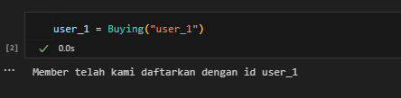
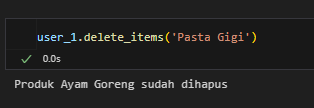
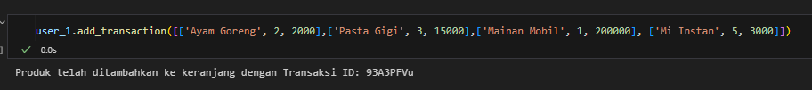
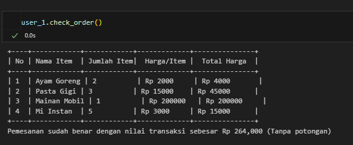

# Project Title

Program Kasir pada Python

## Problem Statement

Andi adalah seorang pemilik supermarket besar di salah satu kota di Indonesia. Andi memiliki rencana untuk melakukan perbaikan proses bisnis, yaitu Andi akan membuat sistem kasir yang self-service di supermarket miliknya. Sehingga customer bisa langsung memasukkan item yang dibeli, jumlah item yang dibeli, dan harga item yang dibeli dan fitur yang lain. Sehingga customer yang tidak berada di kota tersebut bisa membeli barang dari supermarket tersebut. Setelah Andi melakukan riset, ternyata Andi memiliki masalah, yaitu Andi membutuhkan Programmer untuk membuatkan fitur-fitur agar bisa sistem kasir self-service di supermarket itu bisa berjalan dengan lancar.

### Framework

def \_\_init pada Class Buying:

```
1. Meminta pengguna memasukkan username.
2. Mengecek apakah username sudah terdaftar dalam daftar anggota.
    - Jika ya, tampilkan pesan "Member sudah terdaftar, silahkan dilanjut".
    - Jika tidak, tambahkan username ke daftar anggota dan tampilkan pesan "Member telah didaftarkan dengan ID: [username]".
3. Selesai.
```

Flowchart Menambahkan Transaksi (add_transaction):

```
1. Meminta pengguna memasukkan username.
2. Mengecek apakah username sudah terdaftar dalam daftar anggota.
    - Jika tidak terdaftar, tampilkan pesan "User tidak ditemukan!".
    - Jika terdaftar, lanjut ke langkah berikutnya.
3. Meminta pengguna memasukkan ID transaksi.
4. Meminta pengguna memasukkan jumlah item yang ingin ditambahkan.
5. Menyimpan transaksi ke dalam daftar transaksi pengguna.
6. Menampilkan pesan "Produk telah ditambahkan ke keranjang dengan ID: [transaction_id]".
7. Selesai.
```

Flowchart Menampilkan Transaksi (show_transaction)

```
1. Meminta pengguna memasukkan username.
2. Mengecek apakah username terdaftar dalam daftar anggota.
    - Jika tidak terdaftar, tampilkan pesan "User tidak ditemukan!".
    - Jika terdaftar, lanjut ke langkah berikutnya.
3. Meminta pengguna memasukkan ID transaksi.
4. Mengecek apakah ID transaksi ada dalam data pengguna.
    - Jika tidak ditemukan, tampilkan pesan "Transaksi ID tidak ditemukan!".
    - Jika ditemukan, tampilkan detail transaksi.
5. Selesai.
```

Flowchart Mengupdate Data Transaksi (update_transaction_name)

```
1. Meminta pengguna memasukkan username.
2. Meminta pengguna memasukkan ID transaksi yang ingin diperbarui.
3. Meminta pengguna memasukkan nama barang yang ingin diubah.
4. Meminta pengguna memasukkan nama baru untuk barang tersebut.
5. Mengecek apakah transaksi dan barang yang dimaksud ada dalam data pengguna.
    - Jika barang tidak ditemukan, tampilkan pesan "Barang tidak ditemukan dalam transaksi".
    - Jika ditemukan, perbarui nama barang dan tampilkan pesan "Nama barang berhasil diperbarui!".
6. Selesai.
```

Flowchart Menghitung Total Harga dan Diskon (total_price)

```
1. Meminta pengguna memasukkan username.
2. Mengecek apakah username ada dalam daftar anggota.
    - Jika tidak terdaftar, tampilkan pesan "User tidak ditemukan!".
    - Jika terdaftar, lanjut ke langkah berikutnya.
3. Menghitung total harga dari semua transaksi pengguna.
4. Menentukan diskon berdasarkan total harga:
    - Jika total > 500.000 → Diskon 10%.
    - Jika total > 300.000 → Diskon 8%.
    - Jika total > 200.000 → Diskon 5%.
    - Jika total ≤ 200.000 → Tidak ada diskon.
5. Menghitung total harga setelah diskon.
6. Menampilkan total harga yang harus dibayar setelah diskon.
7. Selesai.
```

## Fungsi yang digunakan

```
$ Buying(username)
  # Mendaftarkan pengguna baru sebagai member

$ add_transaction([nama_barang, jumlah, harga])
  # Menambahkan transaksi baru untuk pengguna

$ show_transaction(transaction_id)
  # Menampilkan transaksi berdasarkan ID pengguna

$ update_transaction_name(transaction_id, nama_lama, nama_baru)
  # Mengubah nama barang dalam suatu transaksi

$ update_transaction_quan(transaction_id, nama, quantity_baru)
  # Mengubah nama barang dalam suatu transaksi

$ update_transaction_price(transaction_id, nama, price_baru)
  # Mengubah nama barang dalam suatu transaksi

$ delete_items(nama)
  # Menghapus produk pada transaction id tertentu

$ reset_transaction()
  # Reset transaksi pada user tersebut

$ check_order()
  # Mengecek apakah order sudah sesuai

$ total_price()
  # Total harga pada barang tersebut
```

## Contoh Penggunaan Code









### Kesimpulan

Project ini merupakan sistem kasir berbasis Python yang memungkinkan pengguna untuk melakukan transaksi pembelian dengan fitur seperti pendaftaran member, pencatatan transaksi, pembaruan item, pengecekan pesanan, dan perhitungan total harga dengan diskon otomatis.

Dengan menggunakan struktur berbasis kelas (Buying), sistem ini dirancang agar mudah diperluas dan diintegrasikan dengan aplikasi lain. Fitur seperti pengecekan validitas input dan penggunaan pustaka tabulate juga memastikan pengalaman pengguna yang lebih nyaman.
